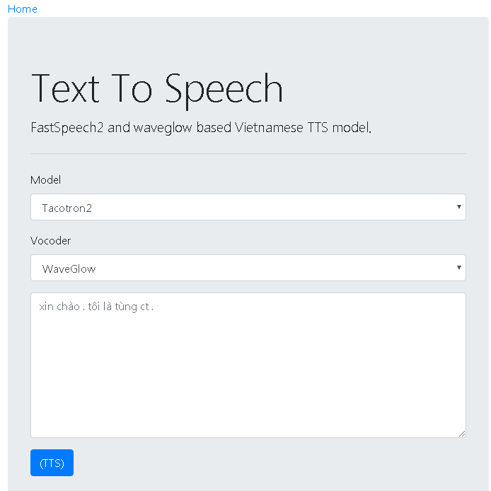

# Flask-TTS-Web-App

This repo was forked  from [NVIDIA/Tacotron2](https://arxiv.org/abs/1712.05884) and [FastSpeech2](https://arxiv.org/abs/2006.04558) for inference test only (not for training).

Because I didn't know flask well, I forked [CodeDem/flask-musing-streaming](https://github.com/CodeDem/flask-music-streaming).

## Requirements

See requirements.txt in this repo.

## Installation

1. `python3 -m pip install -r requirement.txt`

2. you may need models Tacotron2, FastSpeech2, WaveGlow, HifiGan:

    Tacotron2: Vietnamese_38k_steps(vlsp2020 dataset)
    
    FastSpeech2: Vietnamese_120k_steps(vlsp2020 dataset)

    WaveGlow: waveglow_78k_steps(vlsp2020 dataset)
    
    HifiGan: hifigan(LJSpeech dataset)

## Usage

For Linux:

`cd ..../flask-tacotron2-tts-web-app-master/`
`chmod - R 777 start.sh stop.sh restart.sh`
`start.sh`

For Windows:

`cd ..../flask-tacotron2-tts-web-app-master/`
`python3 app.py`

in `hparams.py`, you can change models' path.

​      

​      